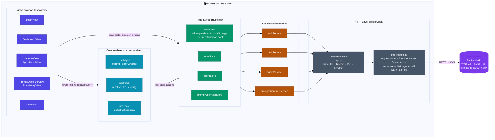
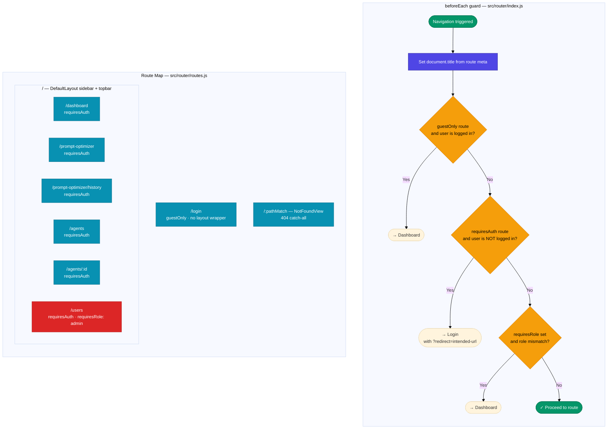
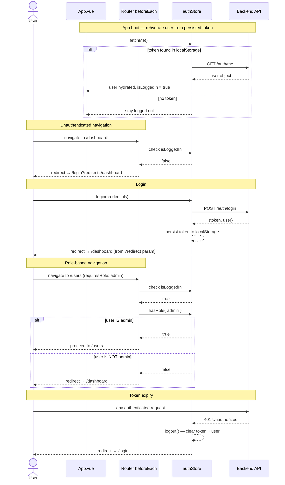

# AgentOps — Architecture Diagrams

## 1. Application Architecture

Data always flows in one direction through fixed layers.
Components never call Axios directly — they go through stores and services.

---

## 2. Router Structure & Auth Guards

All navigation passes through a single `beforeEach` guard in `src/router/index.js`.

---

## 3. Auth Flow — Boot & Login

Shows token persistence, user rehydration on reload, and role-based navigation.

